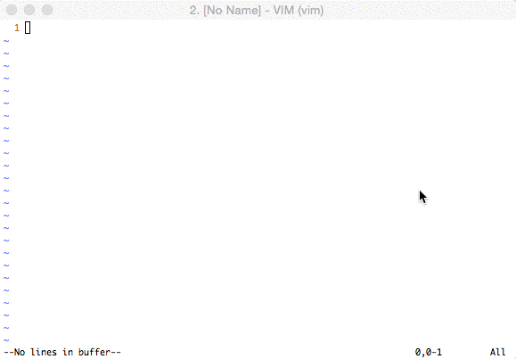

# vim-typings

This is a Vim plugin for [typings/typings](https://github.com/typings/typings) command, which is dependency management tool for TypeScript .d.ts files.



## How to install
### Requirements

* `typings` command (`npm install -g typings`)
* [Shougo/unite.vim](https://github.com/Shougo/unite.vim)

If you use NeoBundle, write the following into your .vimrc:

```vim
NeoBundle 'Shougo/unite.vim'
NeoBundle 'mhartington/vim-typings'
```

And execute `:NeoBundleInstall` command in your Vim, you can get unite.vim and vim-typings.

## How to use
### Unite Source
vim-typings has an Unite source.

Execute `:Unite typings`, so you can get candidates for installable .d.ts files.
Hit enter on selected candidate, so the .d.ts file get installed.

You can execute with keyword. e.g. `:Unite typings:angular`(it's same `typings search angular` in terminal).

### Commands
This plugin provides the following commands:

* `:TypingsInstall file_name1 file_name2 ...`: Install .d.ts files.
* `:TypingsUninstall file_name1 file_name2 ...`: Uninstall .d.ts files.
* `:TypingsInit` : Create typings.json.
* `:TypingsFetch` : Fetch from remote repository
* `:TypingsUpdate` : Update all .d.ts files.

## License
This software is released under the MIT License, see LICENSE.txt.

